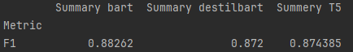
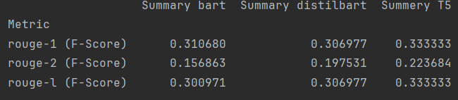

# Streszczanie anglojęzycznych artykułów

Aplikacja pozwala na otrzymanie streszczenia artykułu w języku angielski.
Używając interfejsu webowego, otrzymuje się od razu trzy streszczenia z różnych modeli.

## Instalacja

Instalacja wymaganych modułów

```
pip install -r \requirements.txt
```

Może być też potrzebna instalacja kompilatora Rust'a


## Uruchamianie

Będąc w katalogu projektu wpisz komendę:

```
uvicorn main:app --reload   
```

Program uruchomi sięna porcie 8000.

Aby wejść na stronę domową użyj: `http://localhost:8000/static/index.html`


## Wykorzystane modele AI

Wszystkie modele pochodzą z HuggingFace

* [sshleifer/distilbart-cnn-12-6](https://huggingface.co/sshleifer/distilbart-cnn-12-6) (distilbart)
* [Falconsai/text_summarization](https://huggingface.co/Falconsai/text_summarization) (t5_small)
* [slauw87/bart_summarisation](https://huggingface.co/slauw87/bart_summarisation) (bart)


## Ewaluacja

Ewaluacja przeprowadzona na 50 artykułach pochodzących ze zbioru [BBC News Summary](https://www.kaggle.com/datasets/pariza/bbc-news-summary?select=BBC+News+Summary)


### BERTScore

BERTScore liczy podobieństwo semantyczne tekstów.<br>
- F1 - pozwala porównać przechwycenie kluczowych informacji.



### ROUGE

ROUGE mierzy pokrywające się słowa w tekstach.
- rouge-1 - pokrycie się pojedynczych wyrazów
- rouge-2 - pokrycie się sekwencji dwóch słów
- rouge-l - dopasowanie w najdłuższych wspólnych podciągach



### Wnioski:

* Bazując jedynie na BERTScore użyłbym modelu opartego o Bart (slauw87/bart_summarisation).
* Bazując jedynie na ROUGE, użyłbym modelu opartego o T5-small (Falconsai/text_summarization)
* Biorąc pod uwagę obie metryki, do tworzenia streszczeń wykorzystałbym modelu opartego o T5-small (Falconsai/text_summarization),
  ponieważ ma najlepszy wynik w ROUGE oraz ma drugi najlepszy wynik w BERTScore. 

